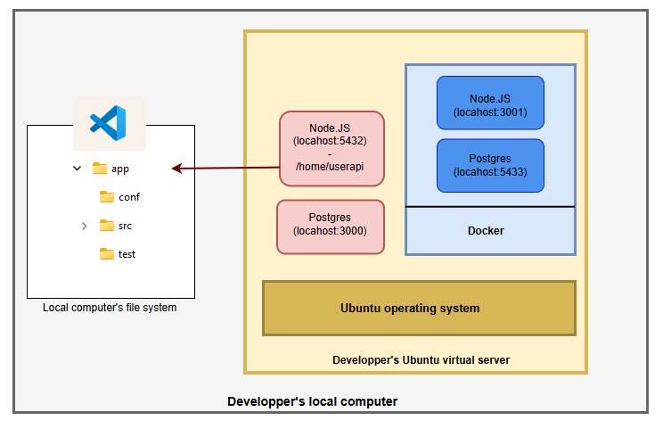
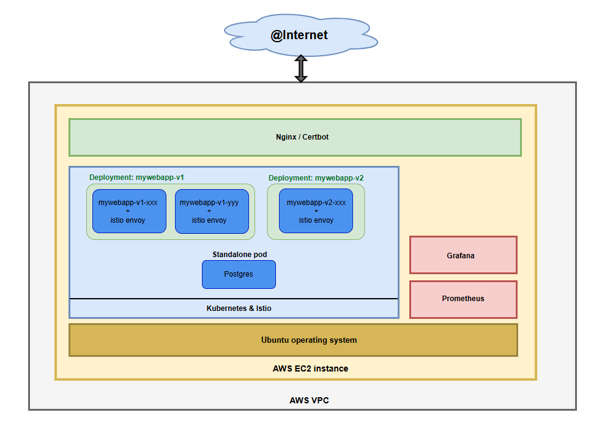
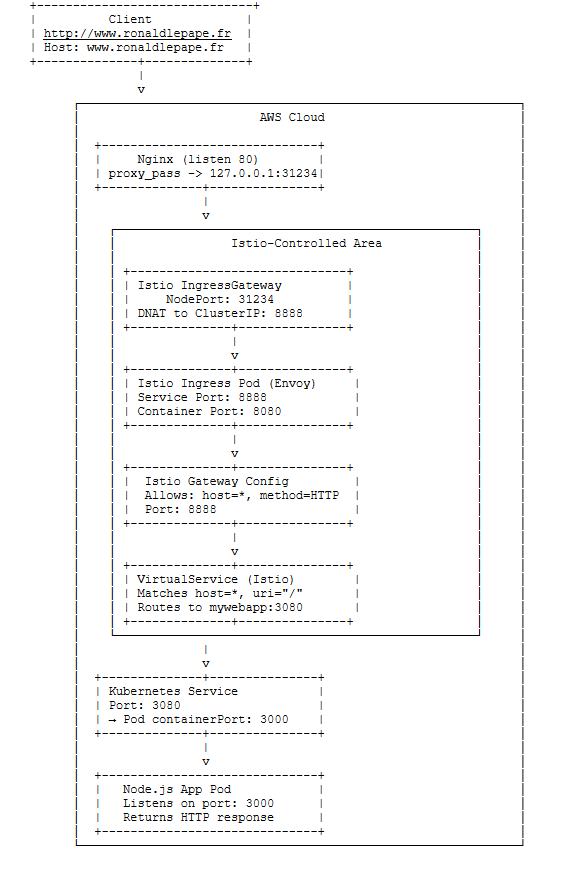

# DEVOPS project for DSTI

### Implementing DevOps technologies, methodologies and philosophy

----
<div style="display: flex; gap: 10px;">
  
  
  
  
  
    
    
</div>

----

## Summary

The goal of this project is to create a CI/CI pipeline, using several Devops tools. A [NodeJS application] exposes webservices that allow simple user management. The data are persisted in a Postgres database. 

- A standardized Ubuntu server is provided to developers as a Virtual Machine using Vagrant and Ansible. Developers use Git to push updates to GitLab, which triggers the CI/CD pipeline.

- A mirror of the repository is maintained in [GitLab] to enable CI/CD via GitLab Pipelines, which includes three stages: Test, Build, and Deploy.

- During the build stage, a Docker image is generated and pushed to Docker Hub, with the image tag derived from the appversion constant defined at the top of the index.js file.

- The application is deployed on AWS using an EC2 instance running K3s (a lightweight Kubernetes distribution). Nginx (with Certbot) acts as a reverse proxy. The setup includes Istio for service mesh and traffic management, enabling canary deployment (e.g., 90% traffic to v1, 10% to v2).

- For monitoring and observability, Prometheus and Grafana are deployed. Both are accessible via the application’s landing page.

List of DevOps tools:

- Git
- GitLab
- Vagrant
- Ansible
- Docker
- Docker Compose
- Kubernetes
- Istio
- Nginx & Certbot
- Prometheus
- Grafana


## Documentation:

Specific README file can be found in each project's subdirectory. The application also exposes its [swagger page].

## Review of the project's folders:

- **Root folder:**
  - .gitlab-ci.yml: defines the GitLab pipeline.
  - docker-compose.yml: defines a Docker containerized deployment of the application. Used in the development Ubuntu server.
- **IaC:**
  - vagrantfile: defines Vagrant script for the creation of the development server.
  - devserver-config.yml (playbooks subdir): this Ansible playbook installs a local classic version of the application (database + web), along with the containerized version (database + web).
  - readme file: contains Istio installation instructions + useful notes.
- **Images:**
  - self-explanatory.
- **Istio - Prometheus - Grafana:**
  - readme file: contains Istio installation instructions + useful notes.
- **Kubernbetes:**
  - *.yml files: configuration files, to be applied in alphabetical ordezr.
  - readme file: contains Istio installation instructions + useful notes.
- **Nginx-Certbot:**
  - readme file: contains Istio installation instructions + useful notes.
- **Postgres:**
  - dockerfile: defines Docker script for the setup and creation of the Postgres database in a Docker container. Used by Docker-compose in developper's Ubuntu server.
  - *.qql files: creation of users table and insertion of 3 users.
- **UserApi:**
  -  App folder: wab application code, along with its tests.
  -  dockerfile: defines Docker script for the creation of the web application in a Docker container. Used by Docker-compose in developper's Ubuntu server.


<br><br>

# Below are some illustrations of the project's main features 

## Developper's environnement:

- Vagrant and Ansible are used to provision a virtual server on the developer's machine, replicating the exact versions of Node and Postgres used in the production environment (AWS):
  - A shared folder allows direct modification of the application in Ubuntu from host machine,
  - Docker and/or Docker compose can be used by thbe developper. Full containerized app is set up by Ansible at virtual machine creation time, with current Production version:
     


- Three command lines are also added to the virtual server to ease start/stop/test operations on local (non-Docker) application:
  - **myapp-start**
  - **myapp-stop**
  - **myapp-test**
 
- Using myapp-test:


 
## Overview of AWS environment:

- This environment represents the CI/CD target = "Production" environment
  - A canary deployment scenario is defined : 90% of traffic directed to v1, 10% to v2 



## Kubernetes and Istio networking layers:

- Nginx reverse proxy exposes the app as well as both Prometheus and Grafana UIs:



## Landing page:

- The page let user interact with the webservice's methods and access to monitoring tools:


## Swagger page:


## GitLab pipeline:

The pipeline and its 3 stages are described in .gitlab-ci.yml file at the root of the repository. Below is a view of 3 pipeline executions. When the project is pushed to the "master" branch, all 3 stages are run in  sequence (Test, Build, Deply). For a push to any other branch, only the Test stage is run. This ensure that test versions are not deployed in AWS.

- The 3 stages are defined at the beginning of .gitlab-ci.yaml file:
  
```
stages:
  - test
  - build
  - deploy

.... Build and Deploy stages are controlled by GitLab rule (below for Deploy stage):

  rules:
    - if: '$CI_COMMIT_BRANCH == "master"'
      when: manual
```

- Pipeline executions:
  - When a "git push" to master branch is done : all 3 stages are performed (Test/Build/Deploy), the last one requires manbual approval:
  - Otherwise only Test stage is performed:


– Storing environment variables in GitLab CI/CD variables enhances security and enables better parameterization of the pipeline:


- New Docker images have been built and uploaded to Docker Hub:

Application's version defined in src/index.js file:


## Visualizing canary deployment with Prometheus:

A canary deployment consists of running two versions of the application (the old one and the new one) simultaneously. Incoming connections are then distributed between the two, with only a small percentage directed to the new version. This approach ensures minimal disruption if the new version fails to meet expectations (by redirecting 100% of traffic back to the old version), or allows for a gradual increase in traffic to the new version if the deployment goes well.

- Canary deployment defined at Istio level in Kubernetes's VirtualService:

```
  ...
  http:
  - route:
    - destination:
        host: mywebapp-service
        subset: v1
      weight: 90
    - destination:
        host: mywebapp-service
        subset: v2
      weight: 10
```


- Prometheus shows how traffic is distributed in a 90-10 manner during a load test:

  The PromQL (PrometheusQL) request below displays how the counter "istio_requests_total" has increased during the last 5 minutes, goupr by "destination_version" (v1 or v2):

  ```
  sum by (destination_version)(
       increase(istio_requests_total{
       destination_app="mywebapp"
       }[5m])
       )
  ```


 - Grafana: a customized dashboard also shows Istio traffic management: 
   - Dashboard json file in "Istio - Prometheus - Grafana" folder 


   - When loading the app with incomin g reqquests:


[NodeJS application]: https://www.ronaldlepape.fr
[swagger page]: https://www.ronaldlepape.fr/api-docs
[GitLab]: https://gitlab.com/ronaldlepape-group/DEVOPS_DSTI_Project


